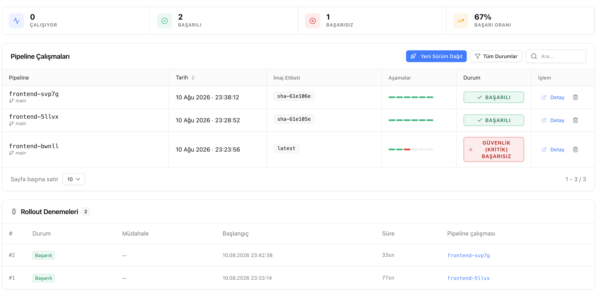
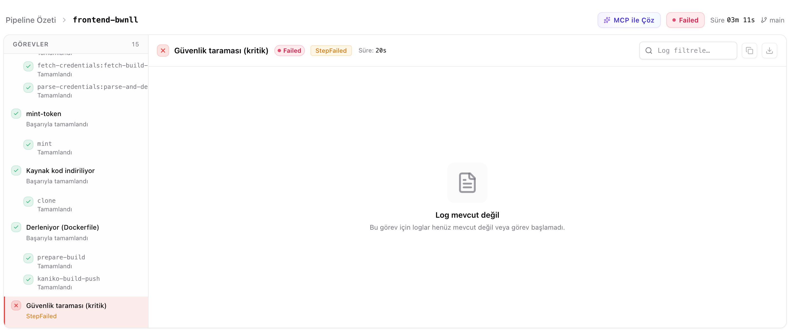
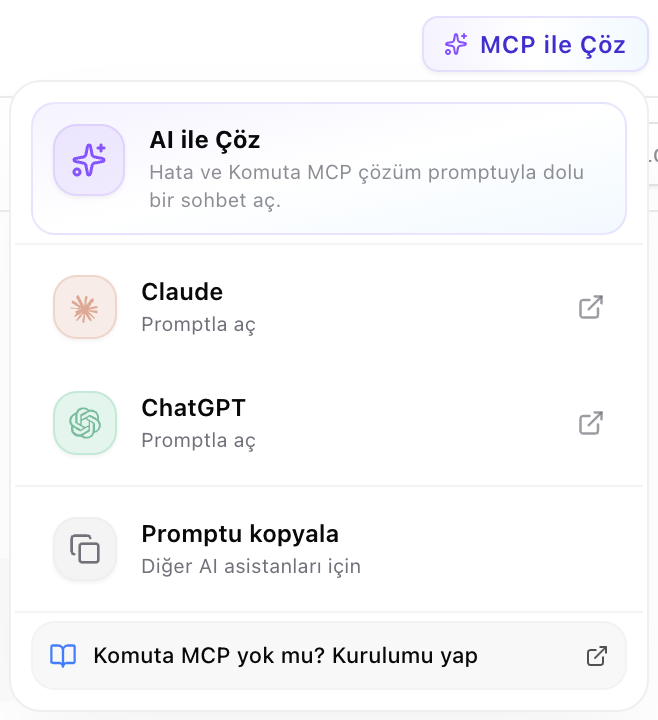

# Pipeline'lar

Pipeline, kodunuzun derlenip güvenlik taramasından geçirilerek servise dağıtılması sürecidir. Servisinizin tüm pipeline çalışmaları burada listelenir.

---

## Pipline Çalışmaları

Listede, her çalışmanın durumunu, hangi branch ve commit'ten geldiğini, ürettiği imaj etiketini ve süresini gösterir.

Bir çalışma satırından çalışan bir pipeline'ı **iptal edebilir**, loglara gidebilir ya da pipeline'ı silebilirsiniz.

> **Uyarı:** Pipeline silmek çalıştırma geçmişini de kaldırır ve geri alınamaz. Çalışan bir pipeline silinemez; önce iptal edin.

---

## Bir Çalışmanın Detayı

Bir çalışmanın detayında, her görevin logları ayrı ayrı incelenir. Başarısız bir çalışmada hatayı bulmanın en hızlı yolu, kırmızı görevi açıp logun son satırlarına bakmaktır. Loglar çalışma sürerken canlı akar; filtreleyebilir, kopyalayabilir ya da indirebilirsiniz.

---

## Otomatik Dockerfile Onarımı
 
Derleme aşaması Dockerfile kaynaklı bir hatayla başarısız olduğunda Komuta devreye girer: hatayı ve Dockerfile'ı analiz eder, bir düzeltme üretir, bunu bir **pull request** olarak açar ve yeni pipeline'ı tetikler. Çalışma detayında bu sürecin verdiği kararları adım adım görürsünüz.
 
Onarım her hatada çalışmaz; çalışmadığı durumlarda hatanın kaynağını ve ne yapmanız gerektiğini belirtir. Örneğin servis bellek limitini aştığı ya da tahliye edildiği için çöküyorsa bu bir Dockerfile sorunu değildir — servisin kaynak paketini yükseltmeniz ya da uygulamanın tükettiği belleği azaltmanız gerekir.
 
> **Not:** Onarımın deneme sayısı sınırlıdır. Aynı düzeltme tekrar tekrar denenmez; sonuç alınamazsa süreç durur ve kararın gerekçesi çalışma detayında kalır.

---

## AI Veya MCP ile Çözme

Başarısız bir çalışmada **AI ile Çöz**, hata loglarını toplayıp hazır bir çözüm promptu üretir. Bunu Claude veya ChatGPT'de doğrudan açabilir ya da kopyalayıp istediğiniz asistana yapıştırabilirsiniz.

Komuta MCP kurulu ise **MCP ile Çöz** daha ileri gider: ajanınız servisin kendisine bağlanır, logları okur ve düzeltmeyi uygulayabilir. Kurulum için [MCP Kurulumu](mcp-setup.md) sayfasına bakın.

---

## Rollout Denemeleri

Derleme başarılı olup dağıtım aşamasında takılan çalışmalar burada listelenir. Komuta bir rollout'un tamamlanmasını belirli bir süre bekler; bu süre dolduğunda ya rollout'u otomatik iptal eder ya da yalnızca bildirir.

Otomatik iptal devredeyse yeni sürüm geri çekilir ve **stabil sürüm trafiği sunmaya devam eder** — takılı bir dağıtım yüzünden servisiniz kesintiye girmez. Hangi denemede ne olduğunu, ne kadar sürdüğünü ve hangi müdahalenin uygulandığını bu listeden görürsünüz.

---

## İlgili Dokümanlar

- [Deploy Stratejileri](deployment-strategies.md) — Dağıtım aşamasının Blue-Green, Canary ve Auto Promote'ta nasıl işlediği.
- [Servis Dashboard](service-dashboard.md) — Yeni sürüm dağıtma ve rollout durumunu izleme.
- [MCP Kurulumu](mcp-setup.md) — Kod ajanınızı Komuta'ya bağlama.
- [İzleme ve Loglar](monitoring-logs.md) — Servis logları ve uyarılar.
