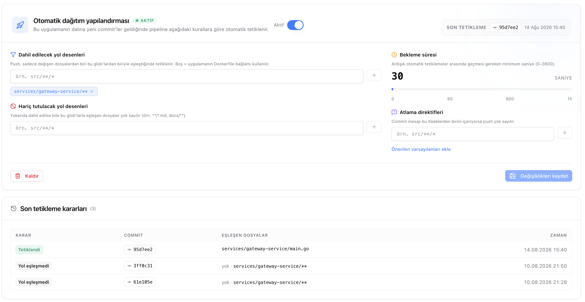
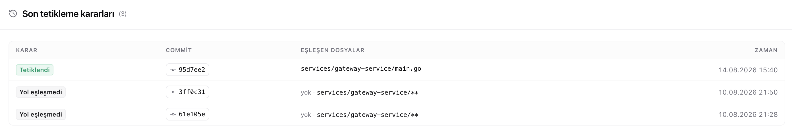

# Otomatik Dağıtım

Otomatik dağıtım açıkken, servisin takip ettiği branch'e her push geldiğinde Komuta pipeline'ı kendisi tetikler ve yeni sürümü yayına alır. Elle deploy tetiklemeye gerek kalmaz.

Her push doğrudan deploy'a dönmez. Komuta önce aşağıdaki kurallara bakar; push bu kurallardan geçerse pipeline başlar, geçmezse atlanır ve nedeni kayda geçer.


---

## Dahil Edilecek Yol Desenleri

Push, yalnızca değişen dosyalardan en az biri buradaki desenlerle eşleştiğinde dağıtım tetikler. Bir monorepo'da tek bir servisin yalnızca kendi klasöründeki değişikliklerle deploy olmasını sağlayan ayar budur.

Desen tanımlanmadığında servisin Dockerfile bağlamı kullanılır — servis repo kökünden derleniyorsa takip edilen branch'e gelen her push deploy eder.

Örnek desenler:

```text
src/**/*
services/api/**
services/gateway-service/**
```

---

## Hariç Tutulacak Yol Desenleri

Dahil etme desenine uysa bile buradaki desenlerle eşleşen dosyalar yok sayılır. Dokümantasyon güncellemesi, README düzeltmesi gibi kod dışı değişikliklerin gereksiz deploy tetiklemesi bu şekilde önlenir.

Örnek desenler:

```text
**/*.md
docs/**
```

> **Not:** Bir push'ta hem dahil edilen hem hariç tutulan dosyalar varsa, hariç tutma yalnızca kendi eşleştiği dosyaları eler; geriye dahil edilen bir dosya kalıyorsa dağıtım yine tetiklenir.

---

## Bekleme Süresi

Ardışık iki otomatik tetikleme arasında geçmesi gereken en az süredir. Varsayılan 30 saniye, en fazla 3600 saniye (bir saat) ayarlanabilir.

Arka arkaya push atılan durumlarda her commit için ayrı bir pipeline başlamasını engeller; bekleme süresi içinde gelen push'lar atlanır.

---

## Atlama Direktifleri

Commit mesajı buradaki ifadelerden birini içeriyorsa push yok sayılır ve dağıtım tetiklenmez. Yayına çıkması istenmeyen bir commit, ayarlara dokunmadan tek seferlik bu yolla atlanır.

Örnek direktifler:

```text
[skip deploy]
[no deploy]
[ci skip]
```

---

## Tetikleme Kararları

Gelen her push için verilen karar commit'iyle birlikte kaydedilir. Beklenen bir deploy başlamadıysa nedeni buradan görülür.


---

## İlgili Dokümanlar

- [Pipeline'lar](pipeline-guide.md) — Tetiklenen dağıtımın derleme ve yayınlama süreci.
- [Dağıtım Geçmişi](deployment-history.md) — Yayına alınan sürümler ve geri alma.
- [Servis Dashboard](service-dashboard.md) — Servisin takip ettiği branch'i değiştirme.
