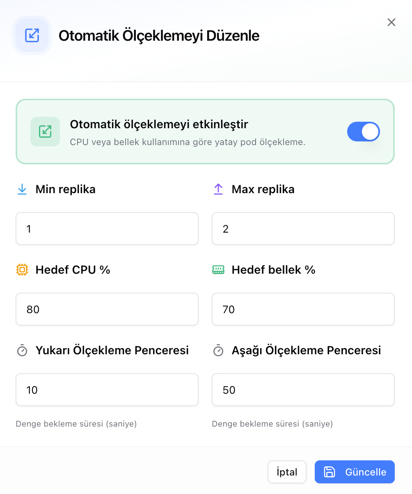

# Otomatik Ölçekleme

Otomatik ölçekleme, servisin replika sayısını yüke göre ayarlar: CPU veya bellek kullanımı belirlenen hedefin üzerine çıktığında replika eklenir, yük düştüğünde kaldırılır.

Düzenlenebilecek ayarlar:

- **Min ve max replika** — servisin inebileceği ve çıkabileceği sınırlar; 1 ile 100 arasında bir değer alır. İkisine aynı sayı yazılırsa servis her zaman o kadar replika ile çalışır: yük artsa da azalsa da sayı değişmez ve hedef yüzdeleri hiç dikkate alınmaz. Sabit replika isteyen servisler için ölçeklemeyi kapatmaya gerek yoktur.
- **Hedef CPU ve bellek yüzdesi** — yeni replika oluşturmak ya da mevcut replikaları kaldırmak için belirlenen eşik. Kullanım bu değerin üzerine çıktığında replika eklenir, altına indiğinde kaldırılır.
- **Ölçekleme pencereleri** — bir ölçekleme kararından sonra ne kadar bekleneceğini saniye cinsinden belirler ve replika sayısının anlık dalgalanmalarla sürekli inip çıkmasını engeller. Boş bırakıldığında varsayılan değer olan 0 saniye geçerli olur; yani bekleme uygulanmaz.
  - **Yukarı ölçekleme penceresi** — replika ekledikten sonra bir sonraki artış için beklenen süre. Kısa tutulması ani yük artışlarına daha hızlı yanıt verir.
  - **Aşağı ölçekleme penceresi** — replika kaldırdıktan sonra bir sonraki azaltma için beklenen süre. Uzun tutulması, trafiği geçici düşen bir servisin kapasitesini erken kaybetmesini önler.

---

## İlgili Dokümanlar

- [Servis Dashboard](service-dashboard.md) — Servisin kaynak paketi ve anlık kullanımı.
- [Dağıtım Geçmişi](deployment-history.md) — Çalışan replika sayısı ve sürüm bilgisi.
